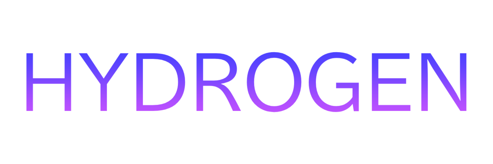

<div align="center">
  
</div>

Elegantly simple; like my smooth brain.

# hydrogen

Light-weight module loader with initialization function to ensure all modules are loaded when required.

Includes loading time for each module and total [ms] taken to load framework.

# Installation via wally
```
hydrogen = "teakzc/hydrogen@0.1.1"
```

# Apologies

This is my first package project I have ever made to use for my games. I am incredibly sorry if this is not optimized nor is it good.

# Known issues
- Framework loading time is 0ms always
